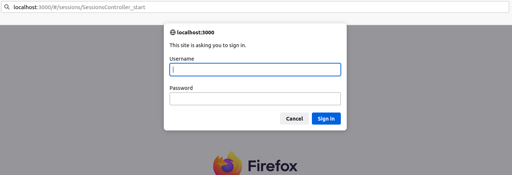


We do not recommend exposing the API on any public networks!

Either protect the API with [**Api Key**](#api-security) or deny access by using firewalls.



👉 Built-in security is available in [**WAHA Plus**]()  version.

## Swagger Security
### Username and password
If you want to hide the project Swagger panel under the password - run the following command to hide under `admin/admin`
login and password.

```bash
docker run -it -e WHATSAPP_SWAGGER_USERNAME=admin -eWHATSAPP_SWAGGER_PASSWORD=admin devlikeapro/waha-plus
```

Open http://localhost:3000/ and enter `admin / admin` in the inputs:




Protecting Swagger under the password does not protect your API from other request! Use both techniques to protect your API and Swagger!


### Disable Swagger
You also can hide swagger completely by setting `WHATSAPP_SWAGGER_ENABLED=false` environment variable.


Disabling Swagger does not protect the API, please use API security as well



### Swagger White Label
You can also set [Swagger White Label]()
options instead of hiding the Swagger panel.


## Dashboard Security
When running WAHA you can set the following environment variables to configure the dashboard:
- `WAHA_DASHBOARD_ENABLED=true` - enable or disable the dashboard, by default `true`. Set to `false` to disable the dashboard.
- `WAHA_DASHBOARD_USERNAME=waha` - username used to log in, by default `waha`.
- `WAHA_DASHBOARD_PASSWORD=waha` - password used to log in, by default `waha`.

Read more about [**Dashboard ->**]()

## API security

You can protect the API by requiring Api Key in a request's headers.


Api Key does not hide your Swagger documentation. Please have a look at the previous section to find how to hide Swagger under the password.


### Set Api Key

Set `WHATSAPP_API_KEY=yoursecretkey` environment variable for that:

```bash
docker run -it -e WHATSAPP_API_KEY=yoursecretkey devlikeapro/waha-plus
```

### Use Api-Key in Swagger

After you set api key - to authorize on swagger use **Authorize** button at the top:


### Add X-Api-Key header

To authorize requests - set `X-Api-Key` header to `yoursecretkey` for all requests that go to WAHA.

#### Python
Example for Python **requests** library:

```python
import requests

headers = {
  'Content-type': 'application/json',
  'X-Api-Key': 'yoursecretkey',
}
requests.get("http://localhost:3000/api/sessions", headers=headers)
```

### Exclude endpoints
If you need to exclude some endpoints (like `GET /health` or `GET /ping`) from the API Key requirement - you can 
set `WHATSAPP_API_KEY_EXCLUDE_PATH` environment variable with a comma-separated list of endpoints (no `/` at the beginning).

```bash
docker run -it \
 -e WHATSAPP_API_KEY_EXCLUDE_PATH="health,ping" \
 -e WHATSAPP_API_KEY=yoursecretkey \
 devlikeapro/waha-plus
```


## Webhook security
To make sure that you get a webhook from your WAHA instance - you can use **HMAC authentication**.
Read more about it on [Webhooks page ->]()

## HTTPS
After you set up the security options - you should set up HTTPS to protect the data in transit and prevent [Man-in-the-middle attacks](https://en.wikipedia.org/wiki/Man-in-the-middle_attack).
That's fine to run it on the **local network** without HTTPS, but for **the production** environment, HTTPS is a must-have.


We recommend handling HTTPS termination with a reverse proxy like Nginx.

Follow
[**🔧 Install & Update - Additional Steps**]() to set up Nginx with Let's Encrypt (it's free).


### Environment variables
WAHA supports HTTPS out of the box, if you don't want to use a reverse proxy like Nginx.

You can set up the following environment variables to enable HTTPS:
- `WAHA_HTTPS_ENABLED=true`: Set this variable to `true` to enable HTTPS. By default, it's `false`.
- `WAHA_HTTPS_PATH_KEY=/path/to/key.pem`: The path to the key file for HTTPS. By default `./.secrets/privkey.pem`
- `WAHA_HTTPS_PATH_CERT=/path/to/cert.pem`: The path to the certificate file for HTTPS. By default `./.secrets/cert.pem`
- `WAHA_HTTPS_PATH_CA=/path/to/ca.pem`: The path to the CA file for HTTPS. By default `./.secrets/chain.pem`

### How to set up HTTPS
Here's available options how you can set up HTTPS:
1. **Self-signed certificate** - generate a self-signed certificate and use it for HTTPS.
2. **Let's Encrypt** - use [Certbot](https://certbot.eff.org/) to get a free certificate from Let's Encrypt.
3. **Using reverse proxy** - use Nginx or Apache as a reverse proxy and set up HTTPS there.

👉 Here's [**Step-by-step guide on how to set up HTTPS for WAHA**]()

