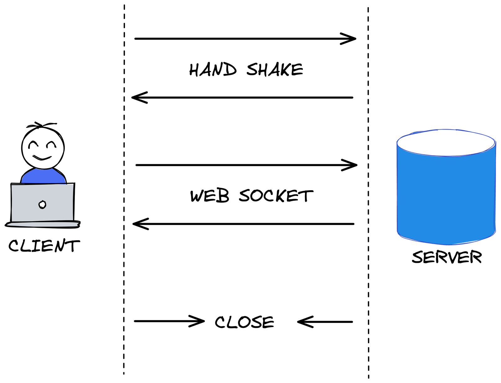
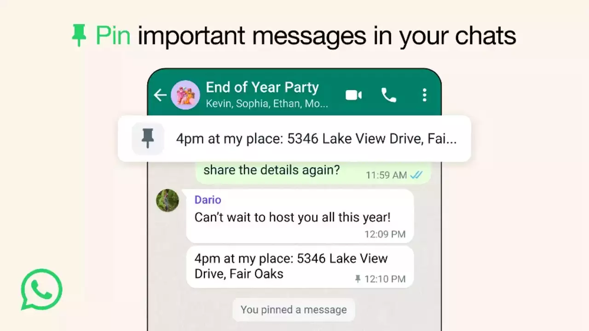

🎉 We are thrilled to announce the release of [**WAHA 2024.11**]() 🎉 

## Event Monitor

Now you can observe the 
[**Events**]()
happening in your WAHA instance in real-time with the new 
[**Event Monitor**]()
feature!



Open
[dashboard/event-monitor](/dashboard/event-monitor) or at your local instance
[http://localhost:3000/dashboard/event-monitor](http://localhost:3000/dashboard/event-monitor)


## Websockets



WAHA now has full support for [Websockets]()!

Here's how you can listen to it using [websocat](https://github.com/vi/websocat?tab=readme-ov-file#installation)

```bash
# Listen all sessions and events
# -E to end the connection when the server closes it
websocat -E ws://localhost:3000/ws
```


```js
// Configuration
const apiKey = '123'; // Replace with your API key
const baseUrl = 'ws://localhost:3000/ws';
const session = '*'; // Use '*' to listen to all sessions
const events = ['session.status', 'message']; // List of events to listen to

// Construct the WebSocket URL with query parameters
const queryParams = new URLSearchParams({
    'x-api-key': apiKey,
    session,
    ...events.reduce((acc, event) => ({ ...acc, events: event }), {}) // Add multiple 'events' params
});
const wsUrl = `${baseUrl}?${queryParams.toString()}`;

// Initialize WebSocket connection
const socket = new WebSocket(wsUrl);

// Handle incoming messages
socket.onmessage = (event) => {
    console.log('Received:', event.data);
};

// Handle errors
socket.onerror = (error) => {
    console.error('WebSocket Error:', error);
};

// Handle connection open
socket.onopen = () => {
    console.log('WebSocket connection established:', wsUrl);
};

// Handle connection close
socket.onclose = () => {
    console.log('WebSocket connection closed');
};
```



## Manage Labels

Now you can manage (create, update, delete) [**🏷️ Labels**](/docs/how-to/labels) using WAHA API!




```bash
POST /api/{session}/labels
```

Using `color`
```json
{
  "name": "New Client",
  "color": 1
}
```

Using `colorHex`
```json
{
  "name": "New Client",
  "colorHex" : "#64c4ff"
}
```





```bash
PUT /api/{session}/labels/{labelId}
```

Using `color`
```json
{
  "name": "New Client",
  "color": 1
}
```

Using `colorHex`
```json
{
  "name": "New Client",
  "colorHex" : "#64c4ff"
}
```
    




```bash
DELETE /api/{session}/labels/{labelId}
```



## Pin Message

You can [**💬 Pin and Unpin Messages**](/docs/how-to/chats#pin-message) in WAHA now!





```
POST /api/{session}/chats/{chatId}/messages/{messageId}/pin
```

Payload:
```json
{
  "duration": 86400
}
```

- 24 hours - `duration=86400`
- 7 days - `duration=604800`
- 30 days - `duration=2592000`

Response:
```json
{
  "success": true
}
```






```
POST /api/{session}/chats/{chatId}/messages/{messageId}/unpin
```

Response:
```json
{
  "success": true
}
```


## And More!
Check out the full [**WAHA 2024.11 🆕 Changelog**]() for more details!