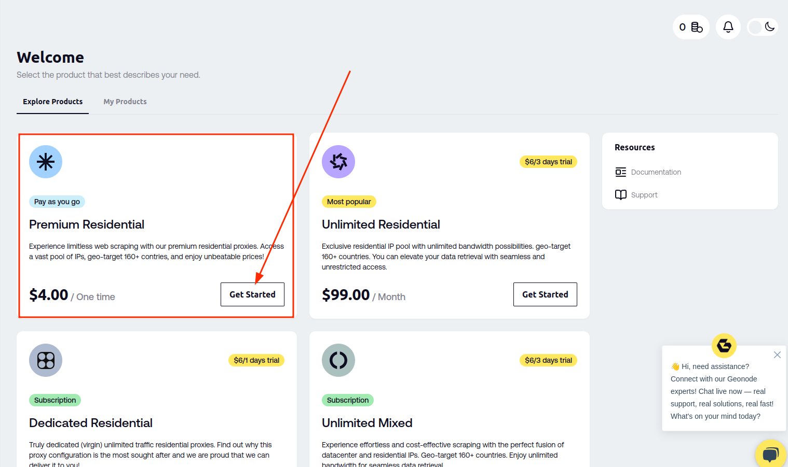
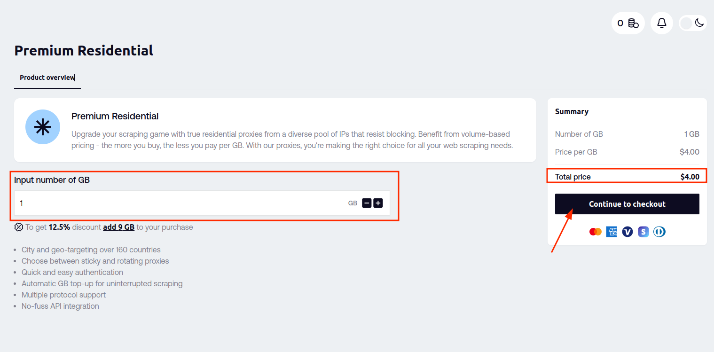
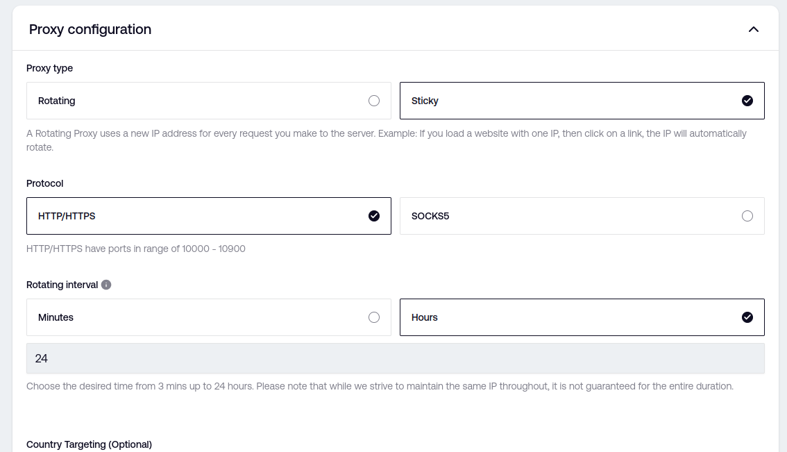
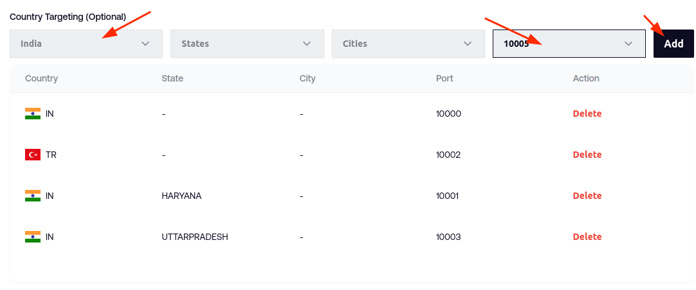
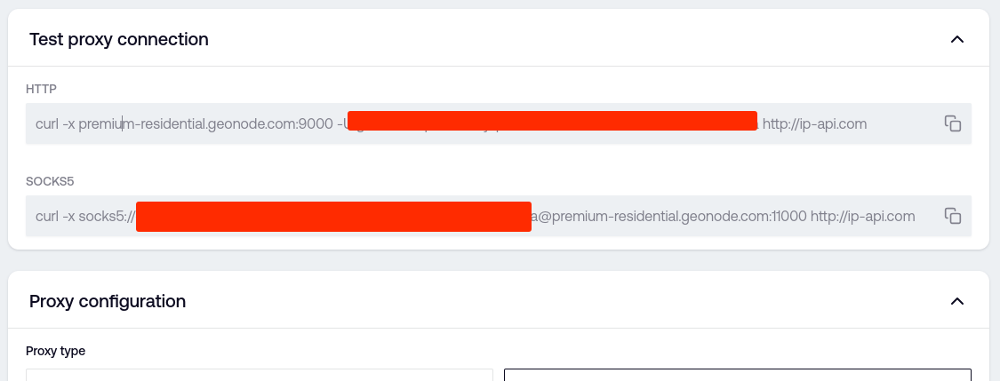
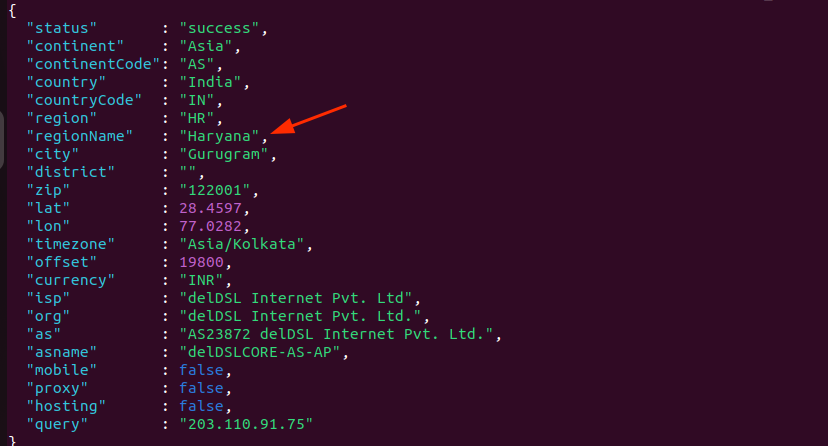
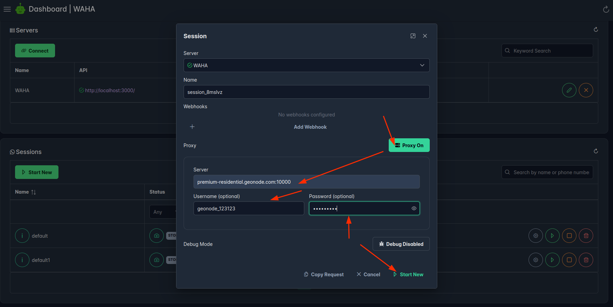

If you see the below error, you can use
the <b><a href="https://geonode.com/invite/90920" target="_blank">Geonode proxies</a></b> to solve this issue.

Read more about [Proxies]().

> Could not log in. Check your phone's internet connection and try again.
> 

Unfortunately, that issue is caused by the WhatsApp server blocking your IP address - likely you're using Cloud or VPS.
The Geonode proxy is a solution that allows you to bypass this block and continue using WAHA.

**The issue has nothing to do with WAHA** itself, but with the WhatsApp server blocking your IP address.

Using
<b><a href="https://geonode.com/invite/90920" target="_blank">Geonode proxy</a></b>
you can bypass the block and continue using WAHA in Cloud or VPS.

💡 **Alternative** is to run [**WAHA locally and expose it with Ngrok**]() to bypass the block.

# Tables of Contents

- [Step 1: Register on Geonode](#step-1-register-on-geonode)
- [Step 2: Get Premium Residential Proxy](#step-2-get-premium-residential-proxy)
- [Step 3: Setup sticky session](#step-3-setup-stiky-session)
- [Step 4: Start WAHA session with Geonode proxy](#step-4-start-waha-session-with-geonode-proxy)
- [Step 5 (optional): Disable proxy for a session](#step-5-optional-disable-proxy-for-a-session)

# Step 1: Register on Geonode

Go ahead and [Sign Up on Geonode](https://geonode.com/invite/90920)!

# Step 2: Get Premium Residential Proxy

Now you need to get a Premium Residential Proxy from Geonode.



<br>

**1GB ($4)** is enough for the start and tests, but you can get more if you need it
(it depends on your usage and how many sessions you want to run).



# Step 3: Setup sticky session

After you've purchased the proxy, you need to set up a sticky session.

Go to [Premium Residential Proxy](https://app.geonode.com/pay-as-you-go-residential) and scroll down to **Proxy
Configuration** and select:

- **Proxy type: Sticky**
- **Protocol: HTTP/HTTPS**
- **Rotating Interval: 24 hours**


<br>
<br>

Now let's configure **Country Targeting (Optional)** (it's not optional for us).

- Select **Country** where YOUR ACCOUNTS (phone numbers) from.
- (Optional) - select **State** if you want to target a specific state
- (Optional) - select **City** if you want to target a specific city
- Select any available **Ports** (one is enough for tests), like `10000`
- Click **Add**



Now you can check the proxy works - copy `curl` command at the top of the page and change port to `10000` (or any you've
selected).



```bash
curl -x premium-residential.geonode.com:10000 -U geonode_1111111111:11111111-1111-1111-1111-111111111111 http://ip-api.com
```



> If it doesn't work, check the proxy targeting configuration and try again with different ports.

# Step 4: Start WAHA session with Geonode proxy

Copy those values from the Geonode dashboard:

- Username
- Password

## Option 1 - Start a session using WAHA Dashboard

Start a session using [WAHA Dashboard]().



## Option 2 - Start a session using Swagger

Or you can use swagger or `curl` to send `POST /api/sessions/start` request with payload

```json
{
  "name": "default",
  "config": {
    "proxy": {
      "server": "premium-residential.geonode.com:10000",
      "username": "geonode_1111111111",
      "password": "11111111-1111-1111-1111-111111111111"
    }
  }
}
```

After that - scan a QR code and it should work!

👉 If you see "Could not connect device, try aging later" - **stop** and **start** session again and scan a new QR.

# Step 5 (optional): Disable proxy for a session

After you got the session working and **waited for 2 minutes** - you can **stop** a session and **start** it again 
**without a proxy**.

```json
{
  "name": "default"
}
```

**Why disable proxy?**

1. It looks that WA checks the IP address at the start of the session, so you can start a session with a proxy and then
   disable it.
2. Proxy is not super stable, so you can disable it and enable it again if you see issues.
3. Proxy is not free, so you can disable it when you don't need it.

# Alternative

If that doesn't work for you - you can run [WAHA on your local network and use Ngrok to expose it to the internet](). 

