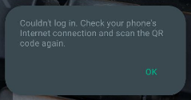

## WAHA + Ngrok

If you see the below error, you can use
the <b><a href="https://geonode.com/invite/90920" target="_blank">Geonode proxies</a></b> to solve this issue.

> Could not log in. Check your phone's internet connection and try again.
> 

Unfortunately, that issue is caused by the WhatsApp server blocking your IP address - likely you're using Cloud or VPS.
The Geonode proxy is a solution that allows you to bypass this block and continue using WAHA.

**The issue has nothing to do with WAHA** itself, but with the WhatsApp server blocking your IP address.

You can bypass the block and continue using WAHA in Cloud or VPS by hosting it on your local network and using Ngrok to
expose it to the internet.

💡 **Alternative** is to [**use Geonode proxy with WAHA**]() to bypass the block.

## Step 1: Run WAHA on local network

Run WAHA on local network (like dedicated home server, spare laptop):

```bash
docker run -d --name waha -v `pwd`/.sessions:/app/.sessions -p 3000:3000/tcp devlikeapro/waha-plus
# Or WAHA Core
# docker run -p 3000:3000/tcp devlikeapro/waha
```

Start and scan the QR code to connect to WhatsApp.

## Step 2: Expose WAHA with Ngrok

Download and install [Ngrok](https://ngrok.com/).



Run Ngrok and expose the WAHA port:

```bash
ngrok http 3000
```

Now you can see the Ngrok URL that you can use to access WAHA from the internet.


## Step 3: Use Ngrok URL in your app

Now you can use the Ngrok URL in your app to connect to WAHA!

## Alternative

If you don't want to run WAHA on your local network, you can [use Geonode proxy]() to
bypass the block.
