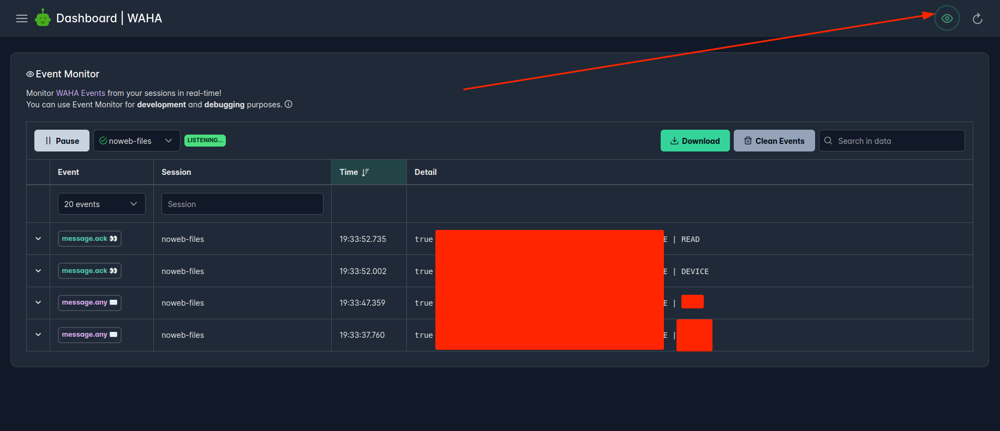

**Dashboard** is a UI to manage your WhatsApp sessions!

<video autoplay loop muted playsinline controls='noremoteplayback' width="100%" poster='/images/waha-dashboard.png'>
  <source src="/videos/waha-dashboard-overview.webm" type="video/webm" />
  Download the <a href="/videos/waha-dashboard-overview.webm">Dashboard Overview video</a> .
</video>

You can access **Dashboard** by running the project and opening
<a href="http://localhost:3000/dashboard" target="_blank">http://localhost:3000/dashboard</a>
(or similar, but with <a href="/dashboard" target="_blank">/dashboard</a> at the end).

ℹ️ **Default username and password**: `waha/waha`

```bash
docker run -it -p 3000:3000/tcp devlikeapro/waha-plus #waha-plus
```

## Configuration

When running WAHA you can set the following environment variables to configure the dashboard:

- `WAHA_DASHBOARD_ENABLED=true` - enable or disable the dashboard, by default `true`. Set to `false` to disable the
  dashboard.
- `WAHA_DASHBOARD_USERNAME=waha` - username used to log in, by default `waha`.
- `WAHA_DASHBOARD_PASSWORD=waha` - password used to log in, by default `waha`.

```bash
docker run -it -p 3000:3000/tcp -e WAHA_DASHBOARD_USERNAME=waha -e WAHA_DASHBOARD_PASSWORD=waha devlikeapro/waha-plus
```

## Api Key
If you're using [API Key](), remember to set up the key in the dashboard.


## Event Monitor
You can observe [**Events**]() in real-time using **Event Monitor**:

[http://localhost:3000/dashboard/event-monitor](http://localhost:3000/dashboard/event-monitor)



## Chat UI
We've built a simple **Chat UI** in Dashboard, so you can see what is possible to implement using WAHA!



You can implement **Live Chat**, **Multiple Agents**, and more features using  
[**WAHA API**](https://waha.devlike.pro/):
- [**💬 Chats API**]()
  to get chats overview and messages.
- [**📤 Send messages API**]()
  to send messages to chats.
- [**🔄 Message ACK**]()
  to get message status.
- [**🔄 Websockets**]()
  to get real-time messages on the client side.

👉 [**Source Code on Github**](https://github.com/devlikeapro/waha-hub/tree/main/ui/components/chat) 
(Vue3 + PrimeVue) available for [WAHA PRO](https://waha.devlike.pro/pricing/#tier-pro) supporters!


## Notes
### Single Dashboard - Multiple Servers
If you're running multiple servers 
(like [**using sharding to handle 50+ sessions ->**]())
you can run a dedicated WAHA just to have a single place where from you can manage all servers:



After that you can connect all server to the single dashboard:



